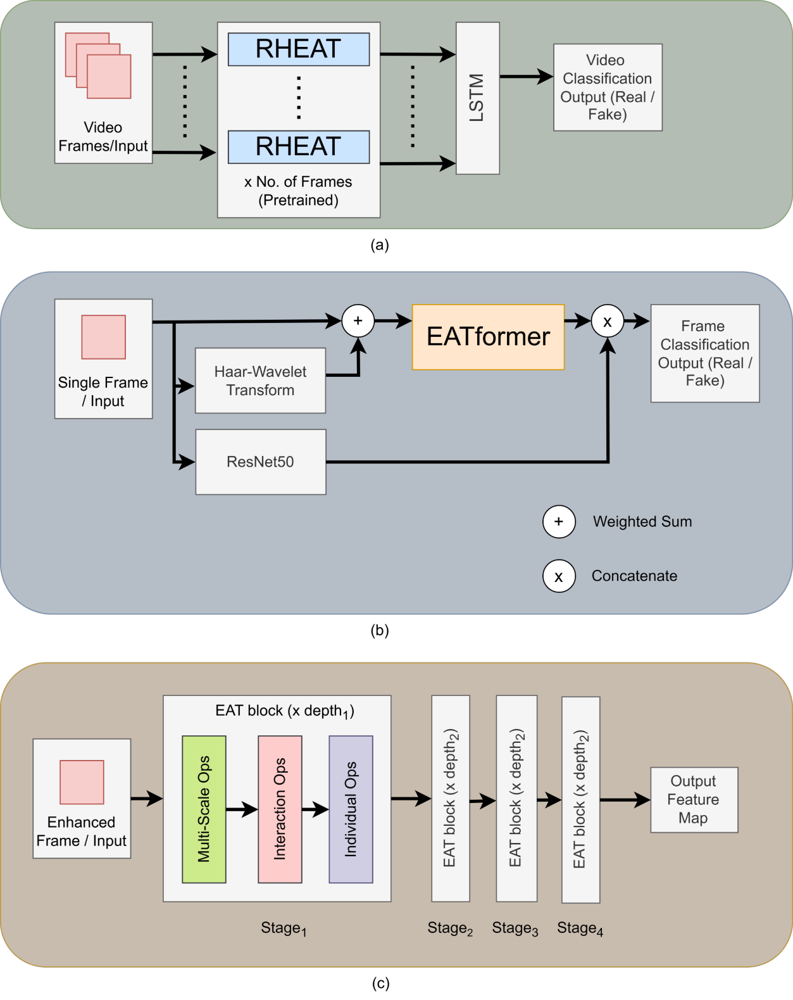
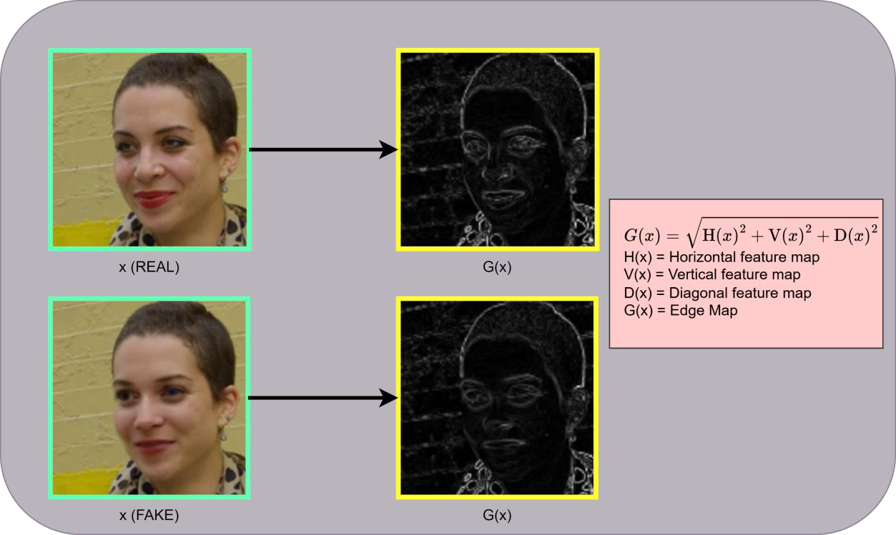
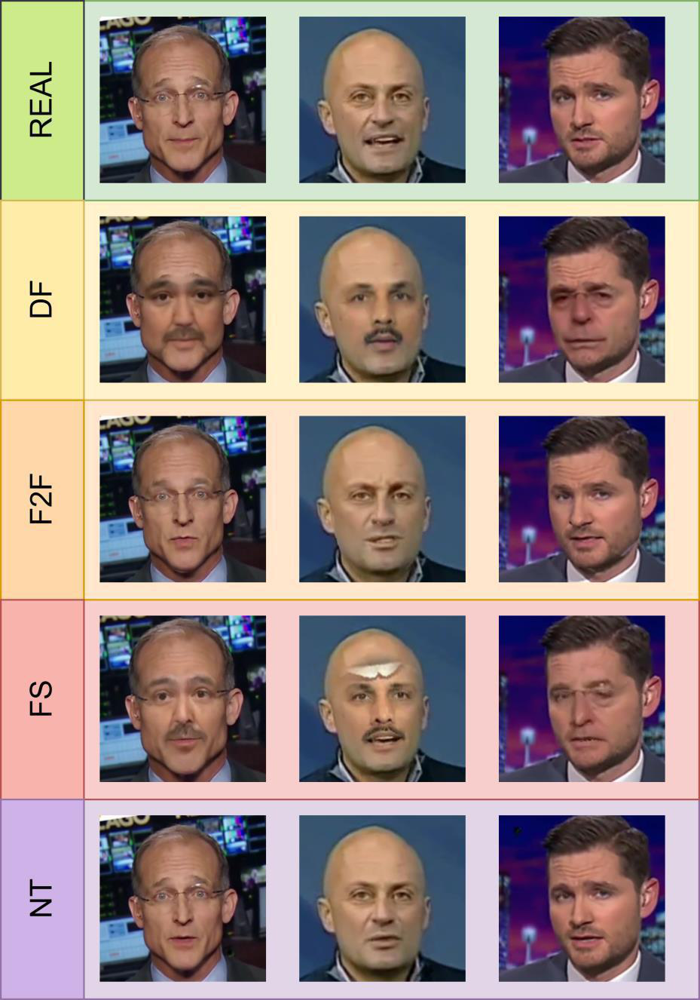
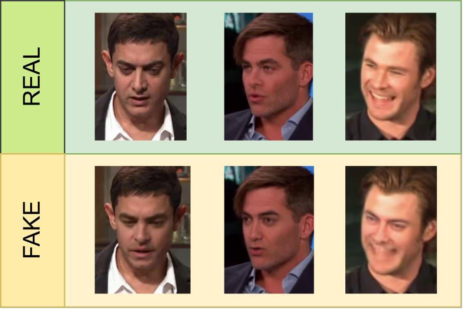
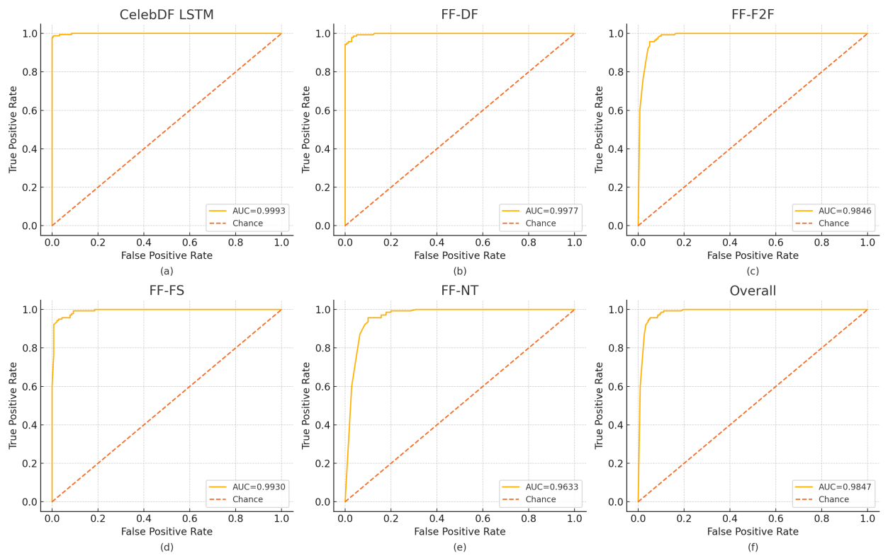
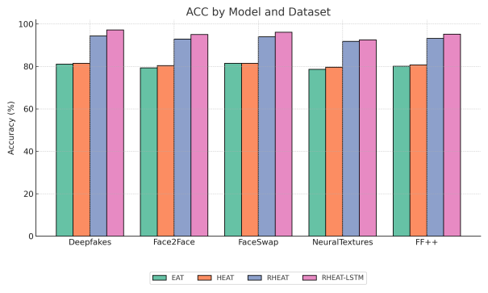

# RHEAT-LSTM: Deepfake Detection

## Abstract

Deepfakes are false media developed by using deep learning technologies. They are used to spread misinformation through various modalities like images and videos. The advancement in deep learning has led to the creation of highly advanced deepfakes, which are indistinguishable from real media. The development of superior deepfake detection technology has become a necessity. There is a lack of evolutionary algorithms being applied for deepfake detection. This paper introduces a novel application of the EATformer attention model in deepfake detection. In the proposed methodology, the EATformer is used to extract global and local spatial features, the Haar-Wavelet transform is used to extract the frequency features, Resnet for CNN features, and LSTM to combine the output of all the frames and get the temporal output of the videos. The EATformer in RHEAT is capable of extracting subtle abnormalities which can be missed by other attention models. This methodology has been tested on diverse datasets like FaceForensics++ and Celeb-DF against state-of-the-art models to definitively prove its efficiency and generalisability. The comparison is made using metrics AUC and accuracy. The AUC and accuracy values achieved are 0.9977 and 97.14% for FF-DF, 0.9846 and 95.00% for FF-F2F, 0.9930 and 96.07% for FF-FS, and 0.9633 and 92.50% for FF-NT, with an overall AUC of 0.9847 and accuracy of 95.18%. On Celeb-DF, the AUC and accuracy values are 0.9993 and 99.23%, respectively.

## Repository Structure

- `src/`: Source code for models and datasets.
- `scripts/`: Training and testing scripts.
- `weights/`: Directory for storing model checkpoints.
- `docs/`: Research paper and other documentation.
- `notebooks/`: Original research notebooks.

## Installation

1. Clone the repository.
2. Install dependencies:
   ```bash
   pip install -r requirements.txt
   ```

## Usage

### Training (Celeb-DF)

To train the LSTM classifier on Celeb-DF features:

```bash
python scripts/train_celebdf.py --data_dir "path/to/CelebDF/Crop/Train"
```

### Testing (FaceForensics++)

To test the model on FaceForensics++ datasets:

```bash
python scripts/test_ffpp.py --data_dir "path/to/FF++" --splits_json "path/to/splits.json"
```

## Proposed Methodology

> 
> _Fig. 3. Proposed Model Architecture (a) RHEAT-LSTM, (b) RHEAT, and (c) EATformer_

The RHEAT-LSTM framework integrates:

1.  **Image Preprocessing**: Face extraction and normalization.
2.  **RHEAT Backbone**: Combines EATFormer (spatial features), ResNet50 (CNN features), and Haar-Wavelet Transform (frequency features).
3.  **LSTM Ensembling**: Aggregates frame-level predictions for video-level classification.

> 
> _Fig. 4. Real face edge map (Up, Sharp) and Fake face edge map (Down, Blurry)._

## Datasets

The model is evaluated on two benchmarks:

1.  **FaceForensics++**: Contains Deepfakes (DF), Face2Face (F2F), FaceSwap (FS), and NeuralTextures (NT).

    > 
    > _Fig. 1. Cropped frames: Real, DeepFakes (DF), Face2Face (F2F), FaceSwap (FS), and Neural Textures (NT), respectively._

2.  **Celeb-DF**: High-quality deepfake videos.
    > 
    > _Fig. 2. Cropped frames from CelebDF: Real, Fake._

## Performance

### 1. Celeb-DF Comparison (Table 1)

| Methods                  | Accuracy (ACC) | AUC        |
| :----------------------- | :------------- | :--------- |
| RNA [29]                 | 66.2%          | -          |
| Trace Extraction [30]    | 65.64%         | 61.07%     |
| Attention-Based Net [31] | 68.33%         | 78.04%     |
| XceptionNet [32]         | 93.7%          | -          |
| DFGNN [16]               | 93.9%          | 95.00%     |
| ViXNet [14]              | 94.40%         | 98.54%     |
| HiFE-EfficientNetB4 [22] | 96.83%         | -          |
| MRT-Net [15]             | 98.15%         | 99.21%     |
| FreqFaceNet [33]         | 98.32%         | 99.81%     |
| **RHEAT-LSTM**           | **99.23%**     | **99.93%** |

> 
> _Fig. 5. ROC curves: (a) Celeb-DF, (b) DeepFakes, (c) Face2Face, (d) FaceSwap, (e) Neural Textures, and (f) FF++ Overall respectively._

### 2. FaceForensics++ Comparison (Table 2)

| Methods               | Deepfakes (ACC/AUC) | Face2Face (ACC/AUC) | FaceSwap (ACC/AUC) | NeuralTextures (ACC/AUC) |
| :-------------------- | :------------------ | :------------------ | :----------------- | :----------------------- |
| Steg.Features [34]    | 73.64 / -           | 73.72 / -           | 68.93 / -          | 63.33 / -                |
| TwoStream-T [35]      | 94.64 / 98.00       | 86.48 / 94.00       | 85.27 / 94.00      | 80.05 / 90.00            |
| MADD [36]             | 91.47 / 97.17       | 96.53 / 99.94       | 91.35 / 96.62      | 86.17 / 93.89            |
| Spatial Restored [26] | 92.15 / 97.40       | 98.54 / 99.94       | 92.44 / 97.24      | 87.04 / 93.76            |
| FreqFaceNet [33]      | 95.03 / 99.19       | 95.83 / 99.21       | 95.81 / 98.88      | 87.24 / 94.45            |
| DFGNN [16]            | 98.97 / 99.00       | 62.49 / 69.00       | 98.07 / 98.00      | 75.09 / 78.00            |
| **RHEAT-LSTM**        | **97.14 / 99.77**   | **95.00 / 98.46**   | **96.07 / 99.30**  | **92.50 / 96.33**        |

### 3. Ablation Study on FaceForensics++ (Table 3)

| Model          | Deepfakes (ACC/AUC) | Face2Face (ACC/AUC) | FaceSwap (ACC/AUC) | NeuralTextures (ACC/AUC) | FF++ Combined (ACC/AUC) |
| :------------- | :------------------ | :------------------ | :----------------- | :----------------------- | :---------------------- |
| EAT            | 81.07 / 96.15       | 79.29 / 94.87       | 81.43 / 94.47      | 78.57 / 92.47            | 80.09 / 94.49           |
| HEAT           | 81.43 / 96.39       | 80.36 / 94.70       | 81.43 / 94.72      | 79.64 / 93.22            | 80.71 / 94.76           |
| RHEAT          | 94.29 / 99.78       | 92.86 / 98.90       | 93.93 / 99.36      | 91.79 / 96.62            | 93.21 / 98.51           |
| **RHEAT-LSTM** | **97.14 / 99.77**   | **95.00 / 98.46**   | **96.07 / 99.30**  | **92.50 / 96.33**        | **95.18 / 98.47**       |

> 
> _Fig. 6. ROC curves for EAT, HEAT, RHEAT, RHEAT-LSTM in FaceForensics++._

> 
> _Fig. 7. Performance comparison using Accuracy and AUC bar plots._
